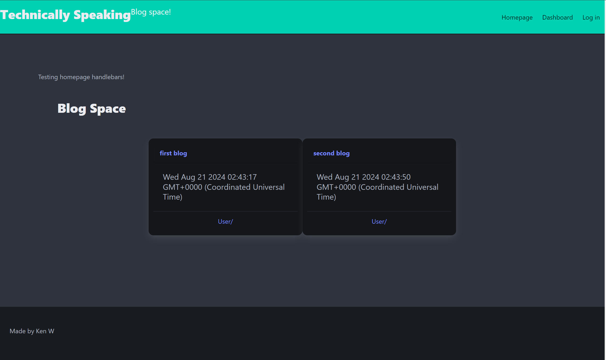

# KW14-Technically-Speaking

## Description

Technically Speaking is a new blog site for new developers to write down their thoughts on all the new things they're learning, and to comment on blogs written by other users.

## Installation

NA

## Usage

When a user navigates to [https://kw14-technically-speaking.onrender.com/](https://kw14-technically-speaking.onrender.com/) they'll be able to see some blogs that have already been created (with test accounts). To make their own blogs they can click on the button in the top right to login. That brings them to the login and signup forms where they can login if they already have an account, or create one with the signup form. Once they have an account they can make their first blog by clicking on "Dashboard" in the nav menu to the top right. Once there, the form to make a new blog can be accessed by clicking the New Blog button, which opens a modal form for their new blog. Once they have made their first blog it'll appear under the New Blog button, along with a list of any blogs they make from now on.

## Credits

[Daniel Revello](https://github.com/Lixiviate) for helping me understand the sequelize models, and user setup and authentication!

## License

This project uses the MIT license, and is available to read on the Github Repo.

## Tests

Users can test the website by creating accounts and writing/commenting on blogs!